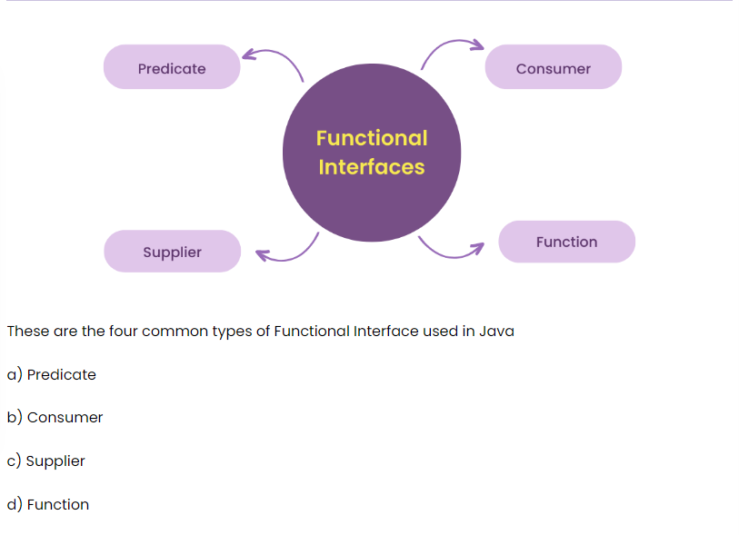

# Getting Started

### What is usage of LinkedHashMap

* In Java, a LinkedHashMap is a data structure that stores key-value pairs in a specific order:

* Insertion    order LinkedHashMap maintains the order in which elements are inserted into the map. This is different from HashMap, which doesn't track the order of insertion.

* Fast access  LinkedHashMap has a constant time complexity for key search, making it a good choice for applications that need fast data access.

* Thread-safe  LinkedHashMap is thread-safe, so it can be used in multi-threaded applications.

* Copy map     LinkedHashMap can be used to create a copy of a map that has the same order as the original.

* Here are some other things to know about LinkedHashMap:

LinkedHashMap is a hash table-based implementation of the Map interface.

LinkedHashMap maintains a doubly-linked list that runs through all of its entries.

LinkedHashMap can have one null key and multiple null values.

LinkedHashMap is non-synchronized. 

It maintains a linked list of the entries in the map, in the order in which they were inserted. This allows insertion-order iteration over the map. That is,when iterating through a collection-view of a LinkedHashMap , the elements will be returned in the order in which they were inserted.

### What is usage of TreeMap

* A TreeMap is used to store key-value pairs in a sorted manner:

* Stores data in a sorted order   Treemaps store data in a sorted order based on the natural ordering of the keys. For example, if the keys are integers, they will be stored in ascending order, and if the keys are strings, they will be stored in alphabetical order.

* Custom sorting   Users can also define their own rule for ordering by using a comparator when constructing a tree map.

* Space-efficient  Treemaps are more space-efficient than HashMaps because they dynamically allocate memory per value added.

* Red-black trees  Treemaps are based on the principles of red-black trees.

* Time complexity  Most TreeMap operations run in O(log(n)) time, where n is the number of elements in the TreeMap.
Treemaps are a Java implementation of the Map interface, and they also implement the SortedMap and NavigableMap interfaces

The TreeMap in Java is a concrete implementation of the java.util.SortedMap interface. It provides an ordered collection of key-value pairs, where the keys are ordered based on their natural order or a custom Comparator passed to the constructor.

### Compare HashMap and ConcurrentHashMap

* The main difference between HashMap and ConcurrentHashMap is that HashMap is not thread-safe, while ConcurrentHashMap is 

* Thread safety   HashMap is not synchronized and is not designed to handle concurrent access from multiple threads. This can lead to data corruption or inconsistency. ConcurrentHashMap is thread-safe and is designed to handle concurrent access safely.

* Performance    HashMap's non-synchronization allows for better performance as multiple threads can operate at the same time. ConcurrentHashMap's performance is comparatively lower because some of the threads need to wait.

* Exceptions    When a thread is iterating a HashMap object, if another thread attempts to modify the object, a run-time exception is thrown. ConcurrentHashMap doesn't throw this exception when modifications are made during iteration.

* Class type    HashMap is a type of class that comes under Traditional Collection, while ConcurrentHashMap is a type of class that comes under Concurrent Collections.

* Key and value  ConcurrentHashMap does not accept null as a key or value.

* In a multi-threading environment, ConcurrentHashMap is preferable. However, when the Map is only accessible to a single thread, HashMap can be a better choice

### The main differences between HashMap and Hashtable are:

* Synchronization  HashMap is not synchronized by default, while Hashtable is. This means that HashMap is better for scenarios where thread safety is not a primary concern, while Hashtable is thread-safe.

* Performance  HashMap is faster than Hashtable because it's not synchronized.

* Null values  HashMap allows one key and many values to be null, while Hashtable does not allow any keys or values to be null.

* ConcurrentHashMap  If multithreading is required, ConcurrentHashMap is a better substitute for Hashtable.

* Here are some more details about HashMap and Hashtable:

* Purpose: Both HashMap and Hashtable are data structures that store key-value pairs.

* Retrieval: A value in a HashMap is retrieved using the key under which it was stored.

* Hash function: A hash table uses a hash function to compute an index into an array of buckets or slots.

* Performance of HashMap operations: Most operations like add(), remove(), and contains() have a constant-time performance of O(1).

* Performance of Hashtable operations: The cost of hash table operations with a good hash function is, on average, O(1 + α). 

The main difference between HashMaps and Hash Tables is their underlying data structure. HashMaps are implemented using an array of linked lists, where each element in the array is a linked list of key-value pairs. Hash Tables, on the other hand, use an array of buckets, where each bucket is a key-value pair

### Is Comparator is a functional interface in Java

Yes, Comparator is a functional interface in Java:
Definition: The Comparator interface is a functional interface that compares two objects and is part of the Java util package.
Method: The Comparator interface has a single method called compare(T o1, T o2) that takes two arguments of type T and returns an integer.
Use: Comparators can be passed to sort methods like Collections.sort or Arrays.
Implementation: Comparators can be implemented using a lambda expression.
Contract: The contract of a comparator is that if o1 < o2, then compare(o1, o2) should return a negative number. If o1 > o2, then compare(o1, o2) should return a positive number. 

Interface Comparator<T> Functional Interface: This is a functional interface and can therefore be used as the assignment target for a lambda expression or method reference. A comparison function, which imposes a total ordering on some collection of objects.

### Is, Comparable is a functional interface in Java:

Yes, Comparable is a functional interface in Java

* Definition  The Comparable interface is a functional interface that defines the compareTo method to compare objects.

* Purpose The Comparable interface is used to sort objects and define custom sorting orders for class objects.

* Implementation  If a class implements the Comparable interface, objects created from that class can be sorted using Java's sorting algorithms.

* The Comparator interface is another functional interface that is often used in conjunction with Comparable for sorting unordered collections.

* In Java, functional interfaces are categorized into four main types based on the operation they perform: Consumer, Supplier, Function, and Predicate

### Functional interfaces were introduced in Java 8 to help developers write cleaner, more concise, and flexible code. They were designed to support lambda expressions, which allow developers to create instances of functional interfaces instead of anonymous classes.

Here are some benefits of using functional interfaces:

* Reduced code lines   Functional interfaces can help reduce the number of lines of code needed to write a program.

* Easier to understand  Code written using functional interfaces is simpler to understand and less prone to mistakes.

* Support for sequential and parallel execution  The Stream API can be used to support both sequential and parallel operations.

* Default method The default method allows developers to add new methods to a class without affecting the existing interfaces.

* Compose method  The Function interface has a default compose method that allows developers to combine multiple functions into one.

* Functional interfaces are implemented using the annotation @FunctionalInterface. 

** Overview. Functional Interfaces introduced in Java 8 allow us to use a lambda expression to initiate the interface's method and avoid using lengthy codes for the anonymous class implementation. Various built-in interfaces were declared with @FunctionalInterface annotation and made functional from Java 8

** Functional interfaces in Java 8 help solve several problems by allowing developers to write more concise, readable, and maintainable code

** Some examples of built-in functional interfaces in Java include Predicate, Consumer, Function, Supplier, and UnaryOperator.

